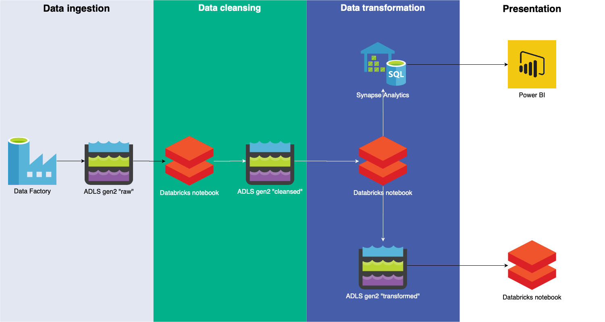
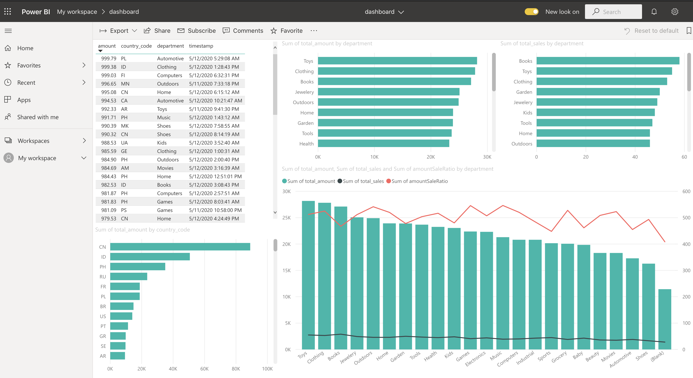

# Terraform module Azure Data Lake

This is a module for Terraform that deploys a complete and opinionated data lake network on Microsoft Azure.

[](https://dataroots.io)
[](https://www.terraform.io)
[](https://registry.terraform.io/modules/datarootsio/azure-datalake/module/)
[](https://github.com/datarootsio/terraform-module-azure-datalake/actions)
[](https://goreportcard.com/report/github.com/datarootsio/terraform-module-azure-datalake)

## Components

* Azure Data Factory for data ingestion from various sources
* 3 or more Azure Data Lake Storage gen2 containers to store raw, clean and transformed data
* Azure Databricks to clean and transform the data
* Azure Synapse Analytics to store presentation data
* Azure CosmosDB to store metadata
* Credentials and access management configured ready to go
* Sample data pipeline (optional)

This design is based on one of Microsoft's architecture patterns for an [advanced analytics](https://docs.microsoft.com/en-us/azure/architecture/solution-ideas/articles/advanced-analytics-on-big-data) solution.


It includes some additional changes that [dataroots](https://dataroots.io) is recommending.

* Multiple storage containers to store every version of the data (raw, cleansed, transformed)
* Cosmos DB is used to store the metadata of the data as a Data Catalog
* Azure Analysis Services is not used for now as some services might be replaced when [Azure Synapse Analytics Workspace](https://docs.microsoft.com/en-us/azure/synapse-analytics/overview-what-is) becomes GA

## Usage

```hcl
module "azuredatalake" {
  source  = "datarootsio/azure-datalake/module"
  version = "~> 0.1" 

  data_lake_name = "example name"
  region         = "eastus2"

  storage_replication          = "ZRS"
  service_principal_end_date   = "2030-01-01T00:00:00Z"
  databricks_cluster_node_type = "Standard_DS3_v2"
  databricks_cluster_version   = "6.5.x-scala2.11"
  databricks_sku               = "standard"
  data_warehouse_dtu           = "DW100c"
  cosmosdb_consistency_level   = "Session"
  cosmosdb_db_throughput       = 400
  sql_server_admin_username    = "theboss"
  sql_server_admin_password    = "ThisIsA$ecret1"
}
```

## Requirements

### Supported environments

This module works on macOS and Linux.

### Databricks provider installation

The module is using the [Databricks Terraform provider](https://github.com/databrickslabs/databricks-terraform). This provider is not in the registry yet and would have to be installed manually. This can be done with the command below:

```sh
curl https://raw.githubusercontent.com/databrickslabs/databricks-terraform/master/godownloader-databricks-provider.sh | bash -s -- -b $HOME/.terraform.d/plugins
```

### Azure provider configuration

The following providers have to be configured:

* [AzureRM](https://www.terraform.io/docs/providers/azurerm/index.html)
* [AzureAD](https://www.terraform.io/docs/providers/azuread/index.html)

You can either log in through the Azure CLI, or set environment variables as documented in the links above.

### Azure CLI

The module uses some workarounds for features that are not yet available in the Azure providers. Therefore, you need to be logged in to the Azure CLI as well. You can use both a user account, as well as service principal authentication.

### PowerShell

The module uses some workarounds for features that are not yet available in the Azure providers. Therefore, you need to have [PowerShell](https://docs.microsoft.com/en-us/powershell/scripting/install/installing-powershell) installed.

## Sample pipeline

The sample pipeline uses generated sales data. In the cleansing phase, personal information is removed and missing values are dealt with. In the transformation phase some aggregated values are calculated to show how each department and country is performing.



Finally, the data is presented in a Power BI dashboard. The dashboard cannot be deployed through Terraform, but you can find it [in the assets folder](assets/dashboard.pbix). You can follow [this guide](POWERBI.md) on how to open the report and connect it to the data lake.



## Configuration

The Azure tenant and subscription can be configured through the providers mentioned above.

### `data_lake_name`

The name of the data lake. This name will be used in every resource so that you can clearly distinguish which resources were created by this module.

Modifying this value after deployment will result in destroying and deploying the complete data lake.

**Required**\
Type: string\
Example: `"example name"`

### `region`

The primary Azure region in which to deploy the data lake. Further configuration options allow to use secondary regions for fail-over and replication purposes.

Modifying this value after deployment will result in destroying and deploying the complete data lake.

**Required**\
Type: string\
Example: `"eastus2"`

### `provision_sample_data`

Whether to provision the sample data pipeline.

Type: bool\
Example: `false`\
Default: `true`

### `provision_synapse`

Whether to provision the Azure Synapse Analytics instance. Note that this has to be `true` for the sample data pipeline to be provisioned.

Type: bool\
Example: `false`\
Default: `true`

### `data_lake_fs_raw`

Name of the data lake filesystem that will contain the raw data. The name of the data lake itself will be appended.

Type: string\
Example: `"raw"`\
Default: `"raw"`

### `data_lake_fs_cleansed`

Name of the data lake filesystem that will contain the cleansed data. The name of the data lake itself will be appended.

Type: string\
Example: `"clean"`\
Default: `"clean"`

### `data_lake_fs_transformed`

Name of the data lake filesystem that will contain the transformed data. The name of the data lake itself will be appended.

Type: string\
Example: `"transformed"`\
Default: `"transformed"`

### `data_lake_filesystems`

A list of additional filesystems to be created in the data lake storage. The module will also make sure that credentials and secrets are deployed in a secure manner to other components to facilitate communication between the services.

Type: list\
Example: `["gdprcompliant", "presentation"]`\
Default: `[]`

### `storage_replication`

Replication strategy to be used for the data lake storage.\
[Available options](https://docs.microsoft.com/en-us/azure/storage/common/storage-redundancy)

**Required**\
Type: string\
Example: `"ZRS"`

### `databricks_cluster_version`

Version of the Databricks runtime, required for the Databricks cluster.\
[Version syntax](https://docs.databricks.com/dev-tools/api/latest/index.html#programmatic-version)\
[Supported versions](https://docs.databricks.com/release-notes/runtime/releases.html#supported-list)

**Required**\
Type: string\
Example: `"6.5.x-scala2.11"`

### `databricks_sku`

The Azure SKU for the Databricks workspace.\
[Available SKUs](https://azure.microsoft.com/en-us/pricing/details/databricks/) (currently "standard" or "premium")

**Required**\
Type: string\
Example: `"standard"`

### `databricks_cluster_node_type`

The Azure SKU for the Databricks driver and workers.

**Required**\
Type: string\
Example: `"Standard_DS3_v2"`

### `databricks_token_lifetime`

Lifetime (in seconds) of the Databricks access token that will be created for communication with other services in the data lake.

**Required**\
Type: number\
Example: `315360000` (10 years)

### `cosmosdb_consistency_level`

Default consistency level for the CosmosDB account.\
[Available consistency levels](https://docs.microsoft.com/en-us/azure/cosmos-db/consistency-levels)

**Required**\
Type: string\
Example: `"Session"`

### `cosmosdb_db_throughput`

Provisioned request units for the CosmosDB account.\
[Request units](https://docs.microsoft.com/en-us/azure/cosmos-db/request-units)

**Required**\
Type: number\
Example: `400`

### `data_warehouse_dtu`

The provisioned Data Warehouse Units for the Azure Synapse Analytics instance. We recommend to scale this as you go.\
[Data Warehouse Units](https://docs.microsoft.com/en-us/azure/synapse-analytics/sql-data-warehouse/what-is-a-data-warehouse-unit-dwu-cdwu)

**Required** (unless you disable the Synapse Analytics Instance with `provision_synapse` set to `false`)\
Type: string\
Example: `"DW100c"`

### `sql_server_admin_username`

The admin username of the SQL server that hosts the Synapse Analytics instance.

**Required** (unless you disable the Synapse Analytics Instance with `provision_synapse` set to `false`)\
Type: string\
Example: `"theboss"`

### `sql_server_admin_password`

The password of the admin account of the SQL server that hosts the Synapse Analytics instance.

**Required** (unless you disable the Synapse Analytics Instance with `provision_synapse` set to `false`)\
Type: string\
Example: `"ThisIsA$ecret1"`

### `service_principal_end_date`

This module uses a service principal to allow communication between the different Azure services. The service principal will no longer be valid after this time.

**Required**\
Type: string\
Example: `"2030-01-01T00:00:00Z"`

## Contributing

Contributions to this repository are very welcome! Found a bug or do you have a suggestion? Please open an issue. Do you know how to fix it? Pull requests are welcome as well! To get you started faster, a Makefile is provided.

Make sure to install [Terraform](https://learn.hashicorp.com/terraform/getting-started/install.html), [Azure CLI](https://docs.microsoft.com/en-us/cli/azure/install-azure-cli?), [Go](https://golang.org/doc/install) (for automated testing) and Make (optional, if you want to use the Makefile) on your computer. Install [tflint](https://github.com/terraform-linters/tflint) to be able to run the linting.

* Setup tools & dependencies: `make tools`
* Format your code: `make fmt`
* Linting: `make lint`
* Run tests: `make test` (or `go test -timeout 2h ./...` without Make)

To run the automated tests, the environment variable `ARM_SUBSCRIPTION_ID` has to be set to your Azure subscription ID.

## License

MIT license. Please see [LICENSE](LICENSE.md) for details.
